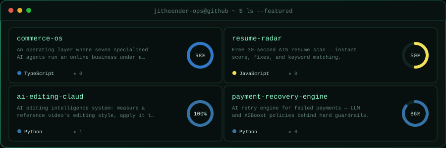

## 🧑‍💻 About Me

- 🎓 B.Tech, 2nd year — passionate about coding and technical stuff
- 🎯 Goal: land a role at a top company, ideally abroad
- 🤖 Currently building AI-agent systems, resume tooling, and full-stack apps
- 🌱 Learning: agentic LLM architectures, Next.js/TypeScript, applied security
- 📍 Based in India
- 💬 Ask me about: Python, TypeScript/React, AI agents, or automation

## 📡 Profile Scan

  

## 🚀 Featured Projects

  

| Project | About |
|---|---|
| [**commerce-os**](https://github.com/jitheender-ops/commerce-os) | Multi-agent AI system that runs an online business under a deterministic governance pipeline — typed tools, policy limits, human approval, full audit trail. |
| [**resume-radar**](https://github.com/jitheender-ops/resume-radar) | Free 30-second ATS resume checker — instant score, concrete fixes, and job-description keyword matching. |
| [**ai-editing-claud**](https://github.com/jitheender-ops/ai-editing-claud) | AI editing-intelligence system: learns a reference video's editing style and applies it to your footage, building the timeline in DaVinci Resolve. |
| [**payment-recovery-engine**](https://github.com/jitheender-ops/payment-recovery-engine) | Recovers failed payments through automated retry orchestration. |
| [**auth-audit**](https://github.com/jitheender-ops/auth-audit) | Tool for auditing authentication flows and configurations. |
| [**phishing-simulator**](https://github.com/jitheender-ops/phishing-simulator) | Educational phishing-simulation tool for security-awareness training. |

See <a href="https://github.com/jitheender-ops?tab=repositories">all repositories →</a>

## 📫 Connect With Me

  
  

Panels are rendered from live GitHub data by a scheduled workflow and committed to this repo — no third-party image service to rate-limit or go down.

