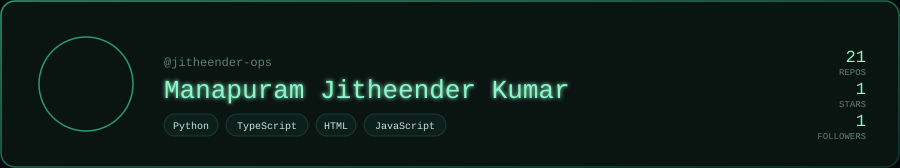
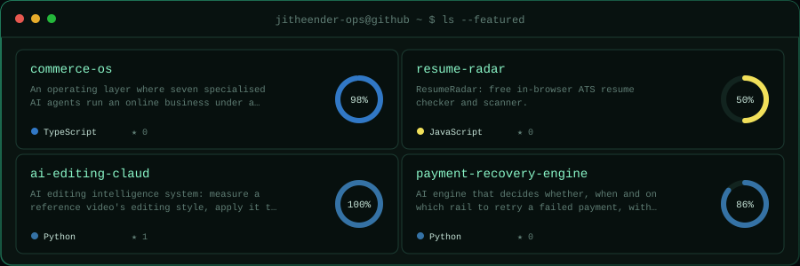

## 🧑‍💻 About Me

B.Tech CS student building AI agents and full-stack apps, aiming for a top engineering role abroad.

- 🤖 Currently building: AI-agent systems, resume tooling, and payment-decision engines
- 🌱 Learning: agentic LLM architectures, Next.js/TypeScript, applied security
- 💬 Ask me about: Python, TypeScript/React, AI agents, or automation

## 📡 Profile Scan

  

## 🚀 Featured Projects

  

See <a href="https://github.com/jitheender-ops?tab=repositories">all repositories →</a>

## 🎮 Play Connect Four

Everyone plays the same board. Click a column and submit the issue that opens; a bot drops your disc and updates this README in under a minute.

<!-- C4:START -->
It's **🔴 Red**'s turn. Click a column to drop a disc:

| [⬇️1](https://github.com/jitheender-ops/jitheender-ops/issues/new?title=connect4%7Cdrop%7C1&body=Just%20press%20%2A%2ASubmit%20new%20issue%2A%2A.%20No%20need%20to%20change%20anything%2C%20the%20bot%20moves%20for%20you.) | [⬇️2](https://github.com/jitheender-ops/jitheender-ops/issues/new?title=connect4%7Cdrop%7C2&body=Just%20press%20%2A%2ASubmit%20new%20issue%2A%2A.%20No%20need%20to%20change%20anything%2C%20the%20bot%20moves%20for%20you.) | [⬇️3](https://github.com/jitheender-ops/jitheender-ops/issues/new?title=connect4%7Cdrop%7C3&body=Just%20press%20%2A%2ASubmit%20new%20issue%2A%2A.%20No%20need%20to%20change%20anything%2C%20the%20bot%20moves%20for%20you.) | [⬇️4](https://github.com/jitheender-ops/jitheender-ops/issues/new?title=connect4%7Cdrop%7C4&body=Just%20press%20%2A%2ASubmit%20new%20issue%2A%2A.%20No%20need%20to%20change%20anything%2C%20the%20bot%20moves%20for%20you.) | [⬇️5](https://github.com/jitheender-ops/jitheender-ops/issues/new?title=connect4%7Cdrop%7C5&body=Just%20press%20%2A%2ASubmit%20new%20issue%2A%2A.%20No%20need%20to%20change%20anything%2C%20the%20bot%20moves%20for%20you.) | [⬇️6](https://github.com/jitheender-ops/jitheender-ops/issues/new?title=connect4%7Cdrop%7C6&body=Just%20press%20%2A%2ASubmit%20new%20issue%2A%2A.%20No%20need%20to%20change%20anything%2C%20the%20bot%20moves%20for%20you.) | [⬇️7](https://github.com/jitheender-ops/jitheender-ops/issues/new?title=connect4%7Cdrop%7C7&body=Just%20press%20%2A%2ASubmit%20new%20issue%2A%2A.%20No%20need%20to%20change%20anything%2C%20the%20bot%20moves%20for%20you.) |
|:-:|:-:|:-:|:-:|:-:|:-:|:-:|
| ⚪ | ⚪ | ⚪ | ⚪ | ⚪ | ⚪ | ⚪ |
| ⚪ | ⚪ | ⚪ | ⚪ | ⚪ | ⚪ | ⚪ |
| ⚪ | ⚪ | ⚪ | ⚪ | ⚪ | ⚪ | ⚪ |
| ⚪ | ⚪ | ⚪ | ⚪ | ⚪ | ⚪ | ⚪ |
| ⚪ | ⚪ | ⚪ | ⚪ | ⚪ | ⚪ | ⚪ |
| ⚪ | ⚪ | ⚪ | ⚪ | ⚪ | ⚪ | ⚪ |

<!-- C4:END -->

## 🐍 Contribution Snake

  <picture>
    <source media="(prefers-color-scheme: dark)" srcset="https://raw.githubusercontent.com/jitheender-ops/jitheender-ops/output/snake-dark.svg" />
    
  </picture>

## 📫 Connect With Me

  
  

Panels are rendered from live GitHub data by a scheduled workflow and committed to this repo — no third-party image service to rate-limit or go down.

